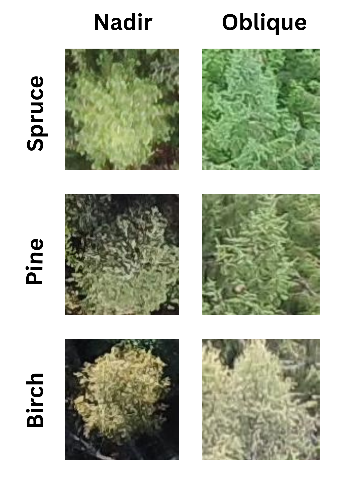
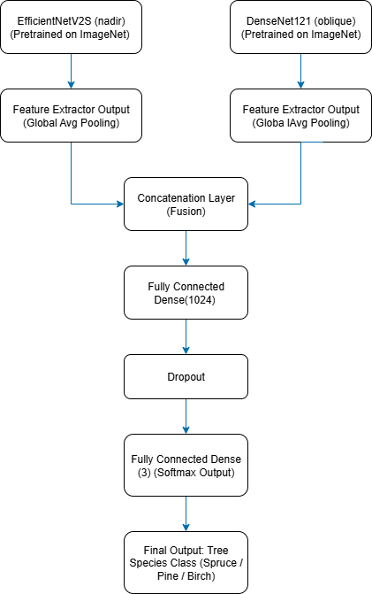

# 🌲 Deep Learning-Based Multi-Angle Classification of Tree Species

> UAV (Drone) imagery + Deep Learning fusion model for accurate, multi-angle tree species classification.

  

 <!-- Optional image -->

## 📜 Overview
This project implements a **feature-level fusion deep learning model** to classify tree species from UAV-captured **nadir** and **oblique** RGB images.  
There are three different species namely Spruce, Pine and Birch.  
We leverage **EfficientNetV2S** for nadir view and **DenseNet121** for oblique view, combining their learned features for viewpoint-robust classification.

**Key Highlights:**
- ✅ Handles **multi-angle drone imagery** effectively.
- 📈 Achieves **90.08% accuracy** and **0.9004 F1-score** on combined test set.
- 🌍 Helps in **forest monitoring, biodiversity evaluation, and ecological planning**.

---

## 🗂 Project Structure

📂 TreeSpecies-MultiAngle 
├── Final_Fusion.ipynb 
├── requirements.txt 
├── README.md  
├── Images/  
│ ├── Fusion_Architecture.png  
│ └── Dataset.  

##  How to Run
### 1. Clone the Repository

git clone https://github.com/ramjangala389/Tree-Species-Classification-Using-CNN.git
cd Tree-Species-Classification-Using-CNN

### 2. Install Dependencies

pip install -r requirements.txt

### 3. Run the Notebook

jupyter notebook Final_Fusion.ipynb

## Model Architecture

    -> Nadir Branch: EfficientNetV2S (pretrained on ImageNet).
    -> Oblique Branch: DenseNet121 (pretrained on ImageNet).
    -> Fusion: Global Average Pooling → Concatenation → Dense Layers → Softmax.

  

---

<i>A JRS Product</i>

